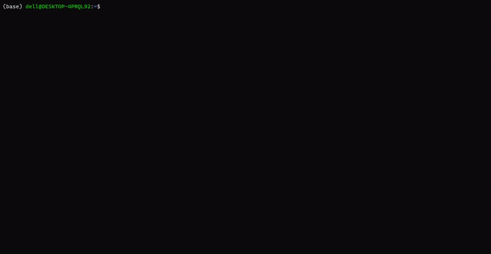

# Matrix-py3

Python3 implementation of [cmatrix](https://github.com/abishekvashok/cmatrix) to ganerate "character falls". 
Matrix-py3 is adapted from [pmatrix](https://github.com/joechrisellis/pmatrix) that is well recommended if you perfer Python2.
It is also noteworthy that a **timer** is added to matrix-py3 for a scheduled stop.



## Installation

+ with conda

```bash
conda install matrix-py3 -c conda-forge
```

+with pip

```bash
pip install matrix-py3
```

## Usage

+ run in command line:

```bash
matrix # run until `Ctrl + C`
matrix 3 # run for 3 seconds
```
+ run in python:

```python
from matrix3 import matrix

matrix # run until `Ctrl + C`
matrix(3) # run for 3 seconds
```
